# Тема 1. Работа с репозиториями

Отчет по Теме #1 выполнил(а):

- Саидахмедов Шахзод
- ИВТ-23-2

| Задание | Лаб.раб |
|---|---|
| Задание 1    | +    |
| Задание 2    | +    |
| Задание 3    | +    |
| Задание 4    | +    |
| Задание 5    | +    |
| Задание 6    | +    |
| Задание 7    | +    |
| Задание 8    | +    |
| Задание 9    | +    |
| Задание 10   | +    |
| Задание 11   | +    |
| Задание 12   | +    |
| Задание 13   | +    |
| Задание 14   | +    |
| Задание 15   | +    |

знак \"+\" - задание выполнено; знак \"-\" - задание не выполнено;

Работу проверили:

- Ротенштрайх Т.В.

## 2.1. Установка 

  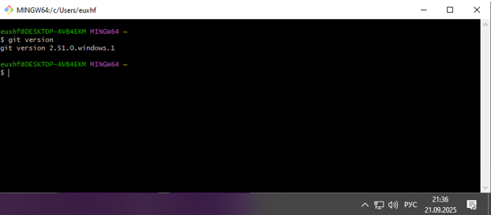

## 2.2. Настройка

  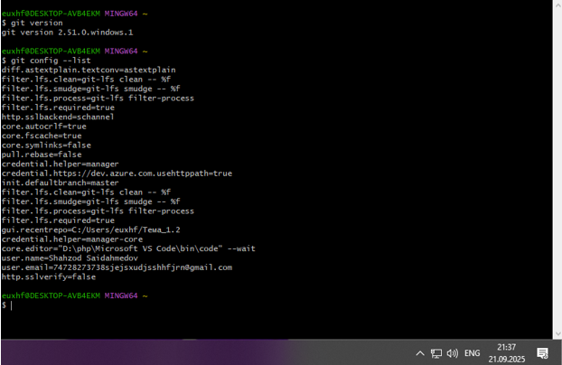

## 2.3. Создание нового репозитория

  

## 2.4. Подготовка файлов

  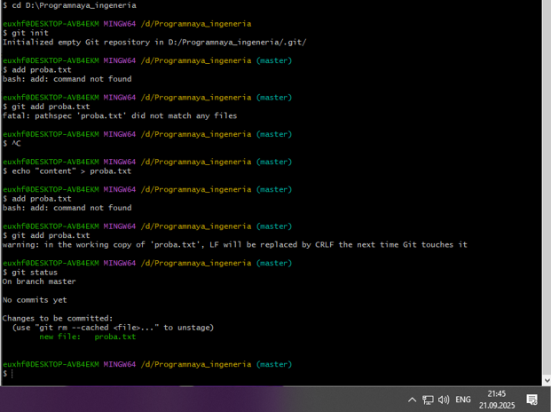

## 2.5. Фиксация изменений

  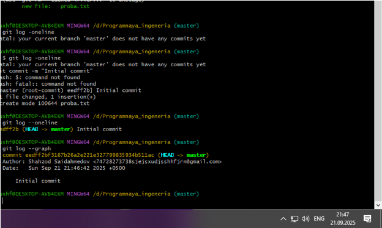

## 2.6. Подключение к удаленному репозиторию

  

## 2.7. Ветвление

  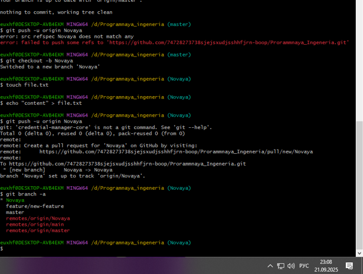

## 2.8. Особенности применения «Фетч»

  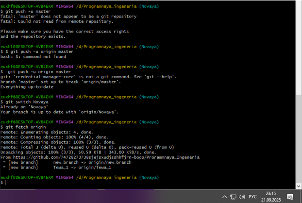

## 2.9. Удаление файлов, веток, локальных и удалённых репозиториев

  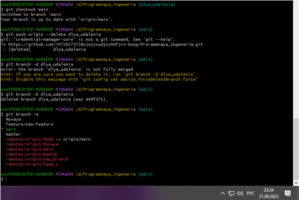

## 2.10. Отслеживание изменений в коммитах

  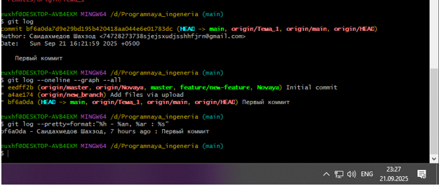

## 2.11. Возвращение файла к предыдущему состоянию

  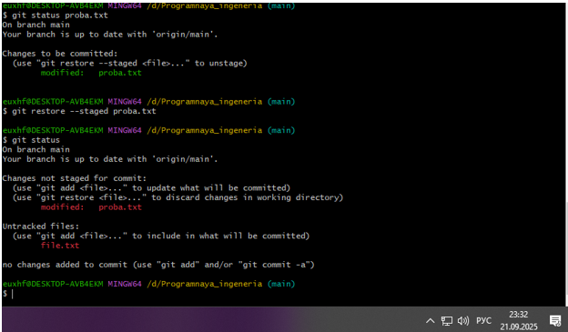

## 2.12. Возвращение к предыдущему коммиту

  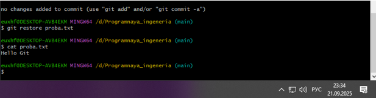

## 2.13. Исправление коммита

  

## 2.14. Разрешение конфликтов при слиянии

  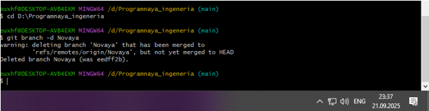

## 2.15. Настройка .gitignore

  <em>Настроил .gitignore</em>

