#Тема 2. Базовые операции языка python

Отчет по Теме #2 выполнил:

- Саидахмедов Шахзод
- ИВТ-23-2

| Задание    | Лаб_раб | Сам_раб |
|---|---|---|
| Задание 1  | +       | +       |
| Задание 2  | +       | +       |
| Задание 3  | +       | +       |
| Задание 4  | +       | +       |
| Задание 5  | +       | +       |
| Задание 6  | +       | +       |
| Задание 7  | +       | +       |
| Задание 8  | +       | +       |
| Задание 9  | +       | +       |
| Задание 10 | +       | +       |

знак "+" - задание выполнено; знак "-" - задание не выполнено;

Работу проверила:

Ротенштрайх Т.В.

Лабороторные задания:

1. Выведите в консоль три строки. Первая - любое число. Вторая - любое число в виде строки.
Третья - любос число с плавающей точкой.

print(123)

print('123')

print(1.23)

  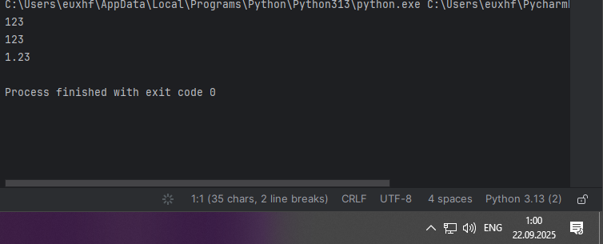

Данная программа выводит в консоль три строки.

2. Выведите в консоль три строки. Первая - результат сложения или вычитания минимум двух переменных типа int. Вторая - результат сложения или вычитания минимум двух переменных типа float. Третья - результат сложения или вычитания минимум двух переменных типа int и float.
print(103838+249903)

print(643.23-283.19)

print(95-1.05+321-34.84)

  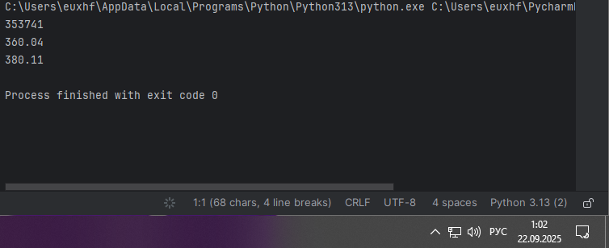

Данная программа выводит в консоль три строки, в которых выполняется сложение, вычитание.

3. Выведите в консоль три строки. Первая - обычная строка. Вторая - F строка с использованием заранее объявленной переменной. Третья - сложите две или более строк в одну.

print('Доброе утро!')

word = 'Доброе'

print(f"{word} утро!")

one = 'Доброе '

two = 'утро!'

print(one+two)

  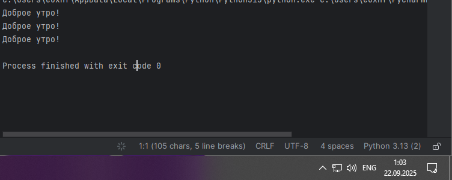

Данная программа выводит в консоль три строки: обычную строку, строку с использованием заранее объявленной переменной, в конце, складываются обе строки.

4. Выведите в консоль три строки. Первая - трансформация любого типа переменной в bool. Вторая - трансформация любого типа переменной в float или int. Третья - трансформация любого типа переменной в str.

x = 'Hi'

print(bool(x))

y = 19439

print(float(y))

z = None

print(str(z))

  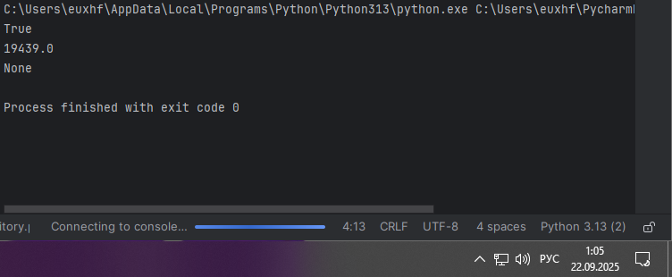

Данная программа выводит в консоль три строки: трансформацию любого типа переменной в bool, трансформацию любого типа переменной в float и трансформацию любого типа переменной в str.

5. Присвойте трем переменным различные значения, воспользовавшись функцией input

x = input('x:')

y = input('y:')

z = input('z:')

print(x,y,z)

  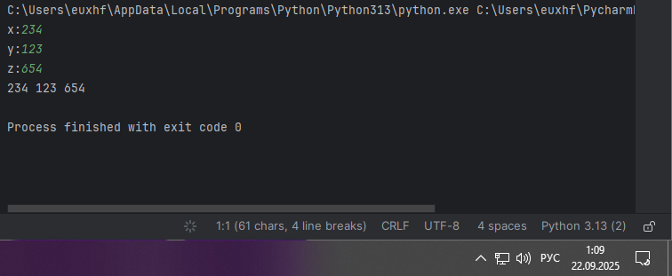

Данная программа присваивает трем переменным различные значения

6.Создайте две любые числовые переменные и выполните над ними несколько математических операций: возведение в степень, обычное деление, целочисленное деление, нахождение остатка от деления. При желании вы можете проверить как работают эти вычисления с разными типами данных, например, сначала создать две переменные int, затем создать две переменные float и наконец создать переменные типа int и float и провести над ними операции, прописанные выше.
x = 9

y = 54

print('возведение в степень - ',x**y)

print('деление - ',x/y)

print('целочисленное деление - ',x//y)

print('остаток отделения - ',x%y)

  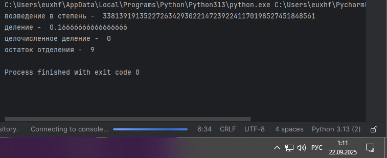

Данная программа создает две любые числовые переменные и выполняет над ними несколько математических операций: возведение в степень, обычное деление, целочисленное деление, нахождение остатка от деления.

7.Создайте любую строковую переменную и произведите над ней математическое действие умножение на любое число.

line = 'Hi!'

print(line*7)

  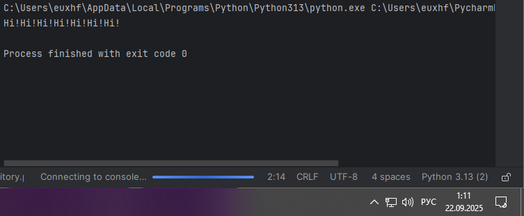

Данная программа создает строковую переменную и производит над ней математическое действие - умножение

8.Посчитайте сколько раз символ 'о' встречается в строхе 'Hello World'.

x = 'Hello World!'

print(x.count('o'))

  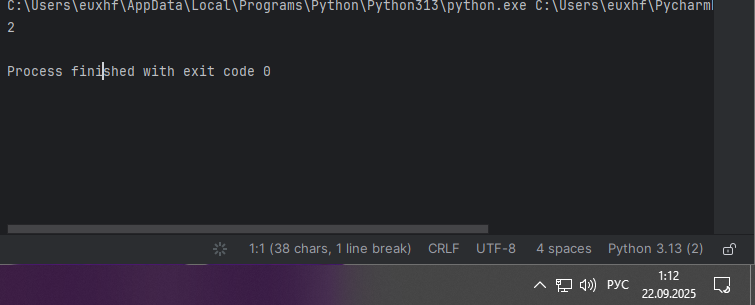

Данная программа считает, сколько раз встречается 'о' в строке 'Hello world'

9.Напишите предложение 'Hello World' в две строки.

print('Hello\nWord')

  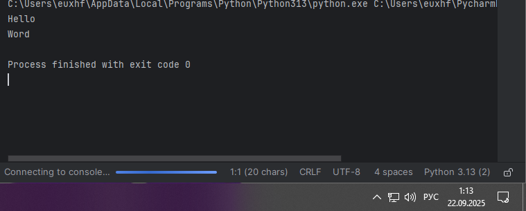

Данная программа пишет предложение в две строки

10. Из предложения 'Hello World' выведите в консоль только 2 символ, а затем выведите слово 'Hello'

x = 'Hello World'

print(x[1])

print(x[:5])

  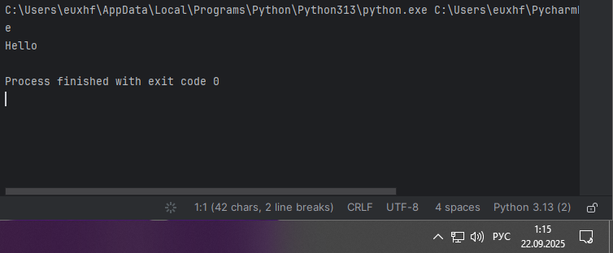

Данная программа выводит в консоль только 2-ой символ и слово 'Hello'

Самостоятельная работа:

1 Выведите в консоль булевую переменную False, не используя слово False в строке или изначально присвоенную булевую переменную. Программа должна занимать не более двух строк редактора кода.

x = 0

print(bool(x))

  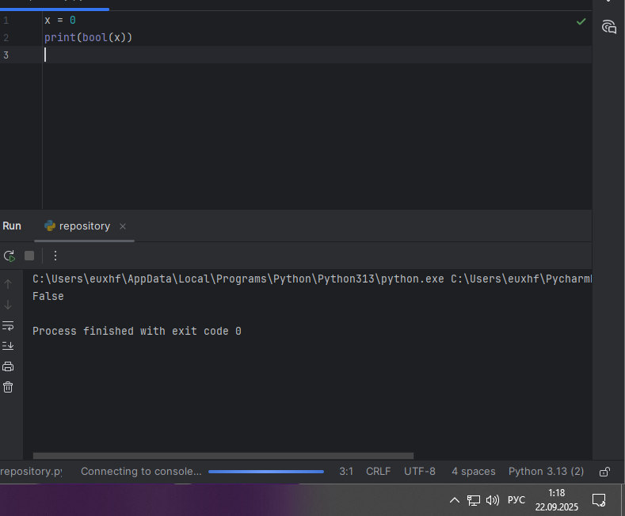

Данная программа выводит в консоль булевую переменную False, не используя слово False в строке или изначально присвоенную булевую переменную.

2 Присвоить значения трем переменным и вывести их в консоль, используя только две строки редактора кода

x = 1231; y = 35105; z = 2313

print(x, y, z)

  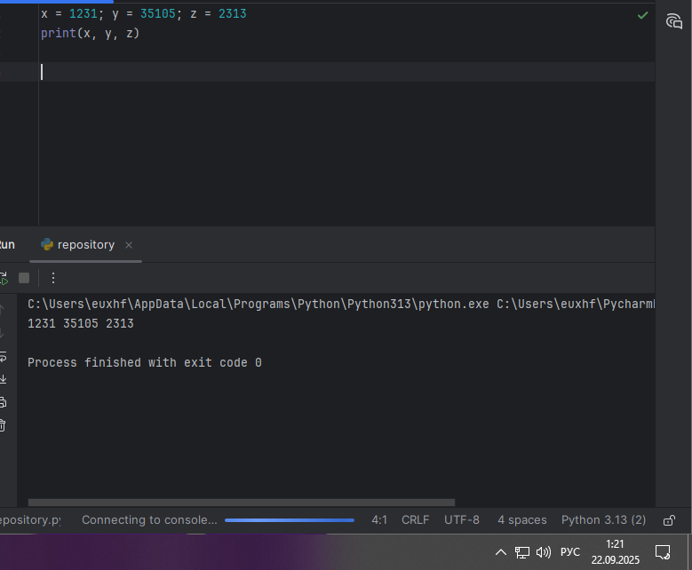

Данная программа присвает значение трем переменным и выводит их в консоль

3 Реализуйте ввод данных в программу, через консоль, в виде только целых чисел (тип данных int). То есть при вводе буквенных символов в консоль, программа не должна работать. Программа должна занимать не более двух строк редактора кода.

x = int(input())

print(x)

  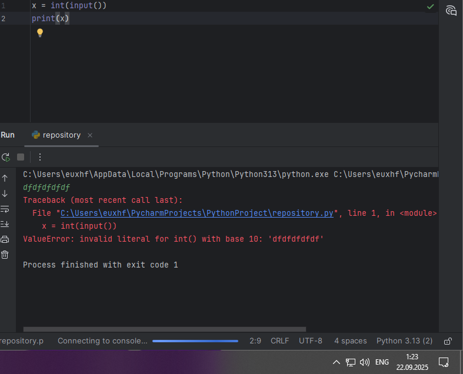

Данная программа реализует ввод данных в программу, через консоль, в виде только целых чисел

4 Создайте только одну строковую переменную. Длина строки должна не превышать 5 символов. На выходе мы должны получить строку длиной не менее 16 символов. Программа должна занимать не более двух строк редактора кода.

x = str("hgo")

print(x*6)

  

Данная программа только одну строковую переменную. Длина строки не превышает 5 символов. На выходе мы получаем строку длиной не менее 16 символов.

5 Создайте три переменные: день (тип данных - числовой), месяц (тип данных - строка), год (тип данных - числовой) и выведите в консоль текущую дату в формате: "Сегодня день месяц год. Всего хорошего!" используя F строку и оператор end внутри print(), в котором вы должны написать фразу "Всего хорошего!". Программа должна занимать не более двух строк редактора кода.

day = int(18); mounth = str("Сентября"); year = str(2024)

print(f"Сегодня, {day}.{mounth}.{year}.",end = " Всего хорошего!")

  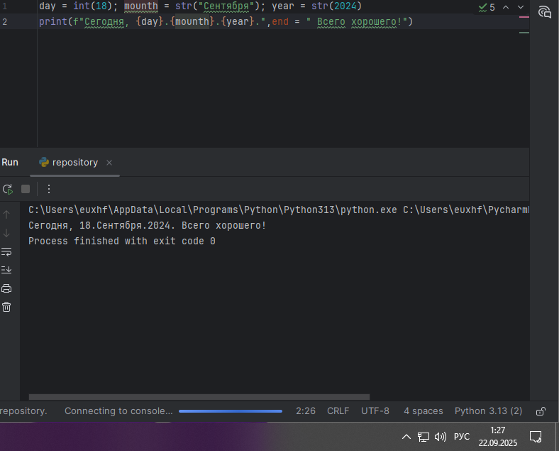

Данная программа создает три переменные: день (тип данных - числовой), месяц (тип данных - строка), год (тип данных - числовой) и выведит в консоль текущую дату в формате: "Сегодня день месяц год. Всего хорошего!" используя F строку и оператор end внутри print(), в котором написана фразу "Всего хорошего!".

6 В предложении 'Hello World' вставьте "my' между двумя словами. Выведите полученное предложение в консоль в одну строку. Программа должна занимать не более двух строк редактора кода.

x = str("Hello my world")

print(x)

  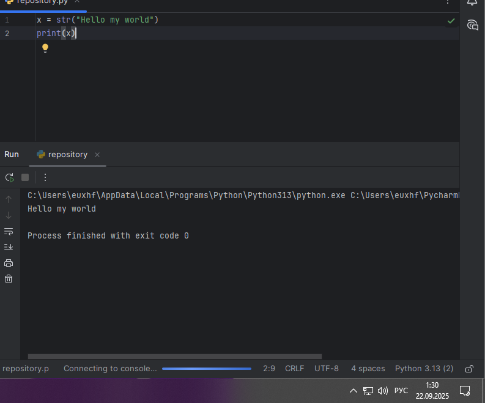

Данная программа вставляет 'my' в предложение 'Hello world'

7 Узнайте длину предложения 'Hello World', результат выведите в консоль. Программа должна занимать не более двух строк редактора кода.

x = str("Hello world")

print(len(x))

  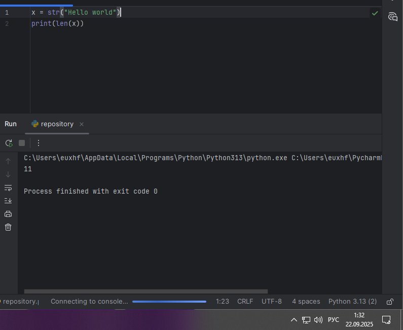

Данная программа узнает длинну предложения 'Hello world'

8 Переведите предложение 'HELLO WORLD' в нижний регистр. Программа должна занимать не более двух строк редактора кода.

x = str("HELLO WORLD")

print(x.lower())

  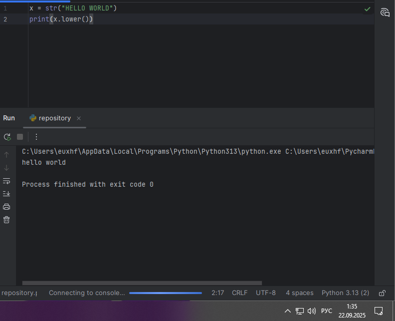

Данная программа переводит предложение 'Hello world' в нижний регистр

9 Самостоятельно придумайте задачу по проходимой теме и решите ее. Задача должна быть связанна со взаимодействием с числовыми значениями.

Выполните действие: Возведение в степень

x = 721

y = 3

print(x**y)

  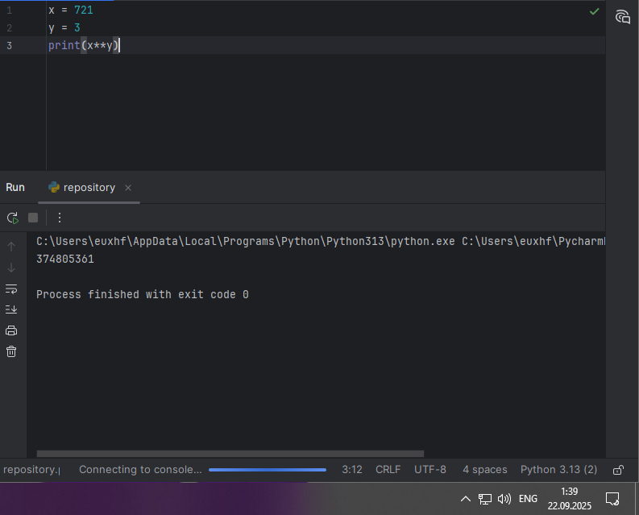

Данная программа выполняет действие: Возведение в степень

10 Самостоятельно придумайте задачу по проходимой теме и решите ее. Задача должна быть связанна со взаимодействием со строковыми значениями.

Выведите 2 строковых переемнных в одну строку и посчитайте ее длину

x = 'B'

print(ord(x))

  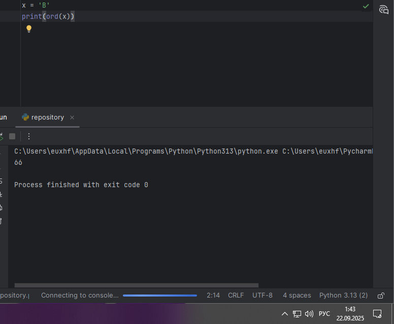

Данная программа выводит 2 строковых переемнных в одну строку и считает ее длину
