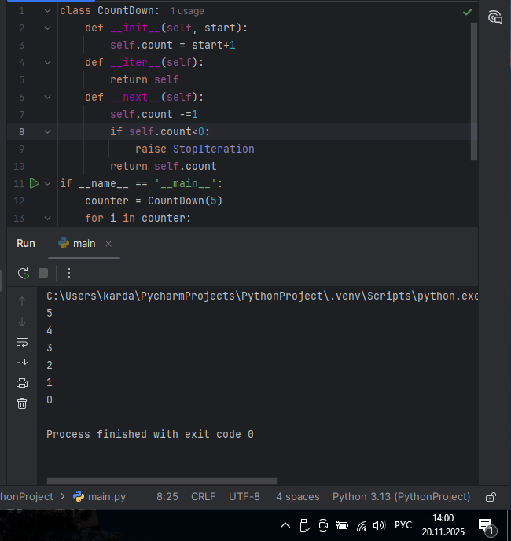
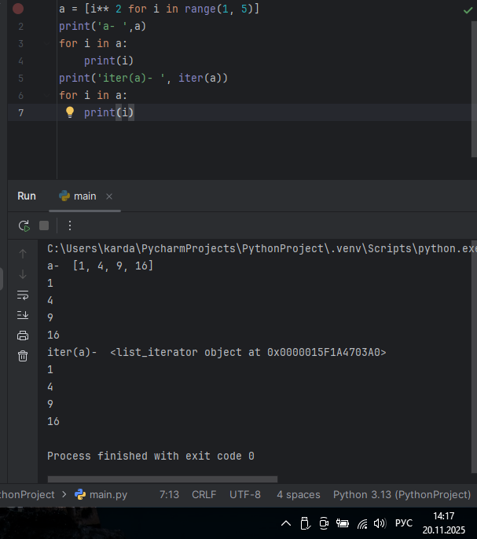
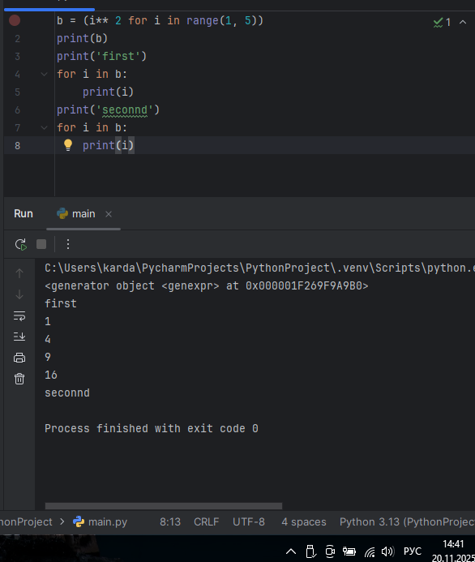
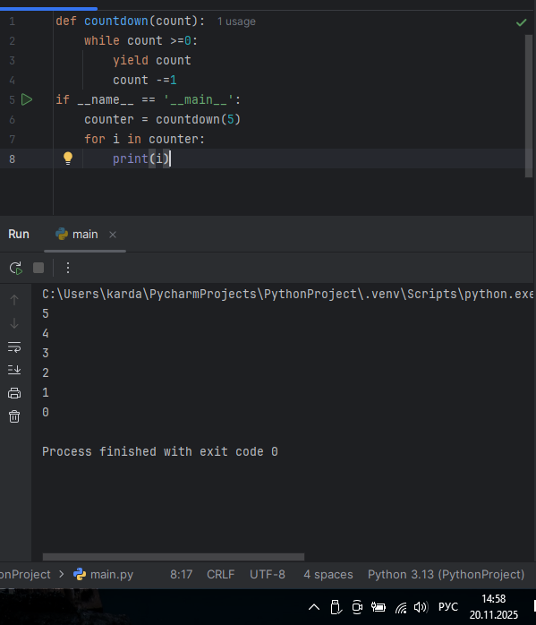
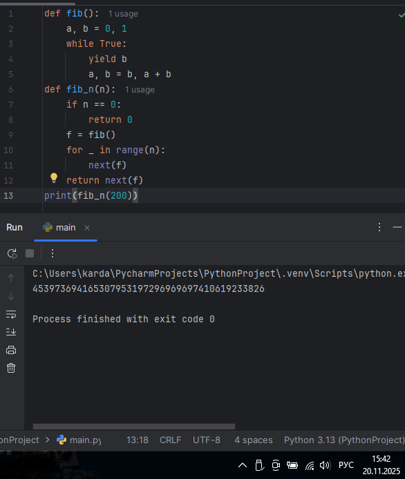
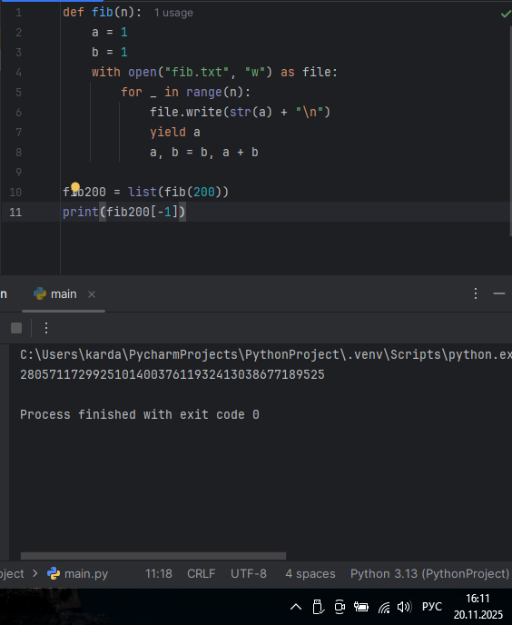
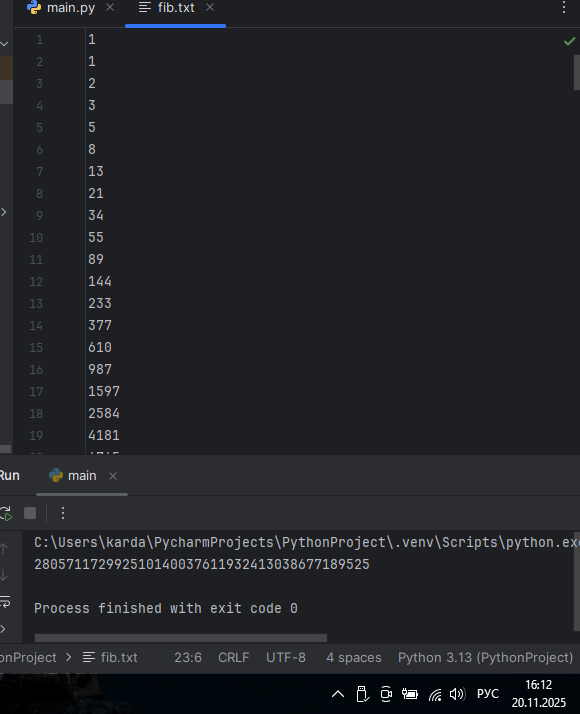

# Тема 11 Итераторы и генераторы.

Отчет по Теме #11 выполнил:
- Саидахмедов Шахзод
- ИВТ-23-2

| Задание | Лаб_раб | Сам_раб |
|---|---|---|
| Задание 1 | + | + |
| Задание 2 | + | + |
| Задание 3 | + |   |
| Задание 4 | + |   |
| Задание 5 | + |   |

знак "+" - задание выполнено; знак "-" - задание не выполнено;

Работу проверили:
- Ротенштрайх Т.В.

---

## Лабораторные задания

### 1.Простой итератор, но у него нет гибкой настройки, например его нельзя развернуть. Он работает просто как next(), но нет prev()

numbers = [0, 1, 2, 3, 4, 5]
for item in numbers:
    print(item)

  
   

###Вывод: В данной программе простой итератор, но у него нет гибкой настройки.

### 2. Класс итератор с гибкой настройкой и удобными применением

class CountDown:
    def __init__(self, start):
        self.count = start+1
    def __iter__(self):
        return self
    def __next__(self):
        self.count -=1
        if self.count<0:
            raise StopIteration
        return self.count
if __name__ == '__main__':
    counter = CountDown(5)
    for i in counter:
        print(i)

  
   
  

###Вывод: В данной программе представлен класс итератор с гибкой настройкой и удобными применением

### 3. Генератор списка.

a = [i** 2 for i in range(1, 5)]
print('a- ',a)
for i in a:
    print(i)
print('iter(a)- ', iter(a))
for i in a:
    print(i)

  
   
  

###Вывод: В данной программе представлен генератор списка

### 4. Выражения генераторы

b = (i** 2 for i in range(1, 5))
print(b)
print('first')
for i in b:
    print(i)
print('seconnd')
for i in b:
    print(i)

  
   
  

###Вывод: В данной программе представлены выражения генераторы

### 5. Такой же счетчик, как и в первом задании, только это генератор и использует yield

def countdown(count):
    while count >=0:
        yield count
        count -=1
if __name__ == '__main__':
    counter = countdown(5)
    for i in counter:
        print(i)

  
   
  

###Вывод: В данной программе представлен такой же счетчик, как и в первом задании, только это генератор и использует yield

---
## Самостоятельная работа

### 1. Вас никак не могут оставить числа Фибоначчи, очень уж они вас заинтересовали. Изучив новые возможности Python вы решили реализовать программу, которая считает числа Фибоначчи при помощи итераторов. Расчет начинается с чисел 1 и 1. Создайте функцию fib(n), генерирующую в чисел Фибоначчи с минимальными затратами ресурсов. Для реализации этой функции потребуется обратиться к инструкции yield (Она не сохраняет в оперативной памяти огромную последовательность, а дает возможность “доставать” промежуточные результаты по одному). Результатом решения задачи будет листинг кода и вывод в консоль с числом Фибоначчи от 200.

def fib():
    a, b = 0, 1
    while True:
        yield b
        a, b = b, a + b
def fib_n(n):
    if n == 0:
        return 0
    f = fib()
    for _ in range(n):
        next(f)
    return next(f)
print(fib_n(200))

  
   
  

###Вывод: Данная программа эффективно рассчитывает числа Фибоначчи без необходимости хранить всю последовательность в памяти, что делает её подходящей даже для больших значений n.

### 2. К коду предыдущей задачи добавьте запоминание каждого числа Фибоначчи в файл "fib.txt", при этом каждое число должно находиться на отдельной строчке. Результатом выполнения задачи будет листинг кода и скриншот получившегося файла

def fib(n):
    a = 1
    b = 1
    with open("fib.txt", "w") as file:
        for _ in range(n):
            file.write(str(a) + "\n")
            yield a
            a, b = b, a + b

fib200 = list(fib(200))
print(fib200[-1])

  
   
  

  
   
  

###Вывод: Данная программа эффективно рассчитывает числа Фибоначчи, она даже запоминает каждое число в файл "fib.txt".
