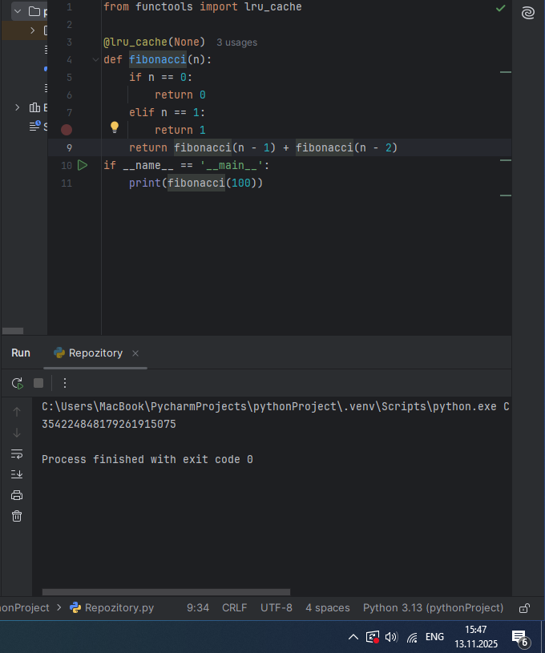

# Тема 4. Функции и модули

Отчет по Теме #4 выполнил:
- Саидахмедов Шахзод
- ИВТ-23-2

| Задание | Лаб_раб | Сам_раб |
|---|---|---|
| Задание 1 | + | + |
| Задание 2 | + | + |
| Задание 3 | + | + |
| Задание 4 | + | + |
| Задание 5 | + | + |
| Задание 6 | + | \ |
| Задание 7 | + | \ |
| Задание 8 | + | \ |
| Задание 9 | + | \ |
| Задание 10 | + | \ |

знак "+" - задание выполнено; знак "-" - задание не выполнено;

Работу проверили:
- Ротенштрайх Т.В.

---

## Лабораторные задания

### 1. Напишите функцию, которая выполняет любые арифметические действия и выводит результат в консоль. Вызовите функцию используя "точку входа".

def main():
    print(2+2)

if __name__ == '__main__':
    main()

  
   

###Вывод: Данная программа выполняетарифметические действия.

### 2. Напишите функцию, которая выполняет любые арифметические действия, возвращает при помощи return значение в место, откуда вызывали функцию. Выведите результат в консоль. Вызовите функцию используя "точку входа".

def main():
    return (2+2)

if __name__ == '__main__':
    print(main())

  
   
  

###Вывод: Данная программа выполняет любые арифметические действия, возвращает при помощи return значение в место, откуда вызивалась функция

### 3. Напишите функцию, в которую передаются два аргумента, над ними производится арифметическое действие, результат возвращается туда, откуда эту функцию вызывали. Выведите результат в консоль. Вызовите функцию в любом небольшом цикле.

def main(one, two):
    result = one + two
    return result

for i in range(5):
    one = 1
    two = 10
    answer = main(one, two)
    print(answer)

  
   
  

###Вывод: В данную функцию передаются два аргумента, над ними производится арифметическое действие, результат возвращается туда, откуда эту функцию вызывали.

### 4. Напишите функцию, на вход которой подается какое-то изначальное неизвестное количество аргументов, над которыми будет производится арифметические действия. Для выполнения задания необходимо использовать кортеж "*args".

def main(x, *args):
    one = x
    two = sum(args)
    three = float(len(args))
    print(f"one={one}\ntwo={two}\nthree={three}")
    return x + sum(args) / float(len(args))

if __name__ == "__main__":
    result = main(16, 9,1,2,-1,1,-1,1,2)
    print(f"\nresult={result}")

  
   
  

###Вывод: На вход данной функции подается какое-то изначальное неизвестное количество аргументов, над которыми будет производится арифметические действия

### 5. Напишите функцию, которая на вход получает кортеж "**kwargs" и при помощи цикла выводит значения, поступившие в функцию. Вызовите функцию используя "точку входа".

def main(**kwargs):
    for i in kwargs.items():
        print(i[0], i[1])
    print()

    for key in kwargs:
        print(f"{key} = {kwargs[key]}")

if __name__ == "__main__":
    main(x=[1, 2, 3], y=[3, 3, 0], z=[2, 3, 0], q=[3, 3, 0], w=[3, 3, 0])
    print()
    main(**{'x':[1, 2, 3], 'y':[3, 3, 0]})

  
   
  

###Вывод: На вход данная функция получает кортеж “**kwargs” и при помощи цикла выводит значения, поступившие в функцию

### 6. Напишите две функции. Первая – получает в виде параметра "**kwargs". Вторая считает среднее арифметическое из значений первой функции. Вызовите первую функцию используя "точку входа" и минимум 4 аргумента.

def main(**kwargs):
    for i, j in kwargs.items():
        print(f"{i}. Mean = {mean(j)}")

def mean (data):
    return sum(data) / float(len(data))

if __name__ == "__main__":
    main(x=[1,2,3], v=[3,3,0])

  
   
  

###Вывод: Данные две функции: Первая - получает в виде параметра “**kwargs”. Вторая считает среднее арифметическое из значений первой функции.

### 7. Создайте дополнительный файл .py. Напишите в нем любую функцию, которая будет что угодно выводить в консоль, но не вызывайте ее в нем. Откройте файл main.py, импортируйте в него функцию из нового файла и при помощи "точки входа" вызовите эту функцию.
def say_hello():
    print(('Здравствуйте!'))

from for_import import say_hello

if __name__ == "__main__":
    say_hello()

  
   
  <em>Рис. 7: Импорт функции из внешнего файла</em>

  
   
  

###Вывод: Создается дополнительный файл .ру. В нум функция, которая будет что угодно выводить в консоль. Открывается файл main.py, импортируется в него функцию из нового файла и при помощи "точки входа" вызывается эта функция.

### 8. Напишите программу, которая будет выводить корень, синус, косинус полученного от пользователя числа.

import math
def main():
    value = int(input("Введите число: "))
    print(math.sqrt(value))
    print(math.sin(value))
    print(math.cos(value))
if __name__ == "__main__":
    main()

  
   
  

###Вывод: Данная программа выводить корень, синус, косинус полученного от пользователя числа.

### 9. Напишите программу, которая будет рассчитывать какой день недели будет через n-нное количество дней, которые укажет пользователь.

from datetime import datetime as dt
from datetime import timedelta as td

def main():
    print(
        f"Сегодня {dt.today().date()}."
        f"День недели - {dt.today().isoweekday()}"

    )
    n = int(input("Введите количество дней: "))
    today = dt.today()
    result = today +td(days=n)
    print(
        f"Через {n} дней будет {result.date()}. "
        f"День недели - {result.isoweekday()}"

    )

if __name__ == "__main__":
    main()

  
   
  

###Вывод: Данная программа рассчитывает какой день недели будет через п-нное количество дней, которые укажет пользователь.

### 10. Напишите программу с использованием глобальных переменных, которая будет считать площадь треугольника или прямоугольника в зависимости от того, что выберет пользователь. Получение всей необходимой информации реализовать через input(), а подсчет площадей выполнить при помощи функций.

global result
def  rectangle():
    a = float(input("Ширина: "))
    b = float(input("Высота: "))
    global result
    result = a * b
def triangle():
    a = float(input("Основное: "))
    h = float(input("Высота: "))
    global result
    result = 0.5 * a * h
figure = input("Выберите фигуру: 1 - прямоугольник, 2 - треугольник: ")
if figure == "1":
    rectangle()
elif figure == "2":
    triangle()
print(f"Площадь: {result}")

  
   
  

###Вывод: Данная программа написана с использованием глобальных переменных, которая будет считать площадь треугольника или прямоугольника в зависимости от того, что выберет пользователь.

---
## Самостоятельная работа

### 1. Дайте подробный комментарий для кода, написанного ниже. Комментарий нужен для каждой строчки кода, нужно описать что она делает.

from datetime import datetime #импорт модуля datetime  из стандартной библиотеки Python.
from math import sqrt # код импортирует функцию sqrt из модуля math. Функция sqrt возращает квадратный корень числа.

def main(**kwargs): # Определение функции main, которая принимает аргумент kwargs.
    for key in kwargs.items():  # Цикл for перебирает все элементы словаря kwargs.
        result = sqrt(key[1][0] ** 2 + key[1][1] ** 2)  # Вычисляется расстояние между двумя точками, где key[1][0] и key[1][1] являются координатами точек.
# Результат сохраняется в переменную result.
        print(result)  # Результат вычисления расстояния между двумя точками выводится на экран.

if __name__ == '__main__':  # Проверка, является ли текущий модуль основным модулем (name), выполняемым при запуске скрипта напрямую, а не через импорт.
    start_time = datetime.now()  # Сохранение текущего времени в переменную start_time.
    main(

           # Запуск функции main с предоставленными параметрами. Эти параметры представляют координаты точек, для которых вычисляются расстояния.
          one=[10, 3],
          two=[5, 4],
          three=[15, 13],
          four=[93, 53],
          five=[133, 15]
    )
    time_costs = datetime.now() - start_time  # Рассчитывается разница между текущим временем и временем начала выполнения программы.
    print(f"Время выполнения программы - {time_costs}")  # Вывод времени выполнения программы на экран.

  
   
  

###Вывод: В данной программе вычисляется расстояние между двмя точками и выводится на экран время, затраченное на выполнение программы.

### 2. Напишите программу, которая будет заменять игральную кость с 6 гранями. Если значение равно 5 или 6, то в консоль выводится "Вы победили", если значения 3 или 4, то вы рекурсивно должны вызвать эту же функцию, если значение 1 или 2, то в консоль выводится "Вы проиграли". При этом каждый вызов функции необходимо выводить в консоль значение "кубика".

import random

def kub():
    x = random.randint(1,6)
    print(x)
    if x == 5 or x == 6:
        print("Победа!")
    elif x == 3 or x == 4:
        kub()
    elif x == 1 or x == 2:
        print("Вы выиграли!")

if __name__ == "__main__":
    kub()

  
   
  

###Вывод: Данная программа замееняет игральную кость с 6 гранями, с помощью рандома выпадает случайное число. В консоль выводится выигрыш или проигрыш, в зависимости от числа, которое выпало.

### 3. Напишите программу, которая будет выводить текущее время, с точностью до секунд на протяжении 5 секунд. Программу нужно написать с использованием цикла.

import datetime
import time

def main():
    while True:
        current_time = datetime.datetime.now().strftime("%H:%M:%S")
        print(current_time)
        time.sleep(1)

if __name__== "__main__":
    main()

  
   
  

###Вывод: Данная программа выводит текущее время, с точностью до секунд на протяжении 5 секунд.

### 4. Напишите программу, которая считает среднее арифметическое от аргументов вызываемое функции, с условием того, что изначальное количество этих аргументов неизвестно. Программу необходимо реализовать используя одну функцию и "точку входа".

def main(*args):
    total = sum(args)
    count = len(args)
    result = total/count
    return result
print(main(1,2,3,4,5,6,7,8,9))
print(main(3,7,1))

  
   
  

###Вывод: Данная программа считает среднее арифметическое от аргументов вызываемое функцией.

### 5. Создайте два Python файла, в одном будет выполняться вычисление площади треугольника при помощи формулы Герона (необходимо реализовать через функцию), а во втором будет происходить взаимодействие с пользователем (получение всей необходимой информации и вывод результатов).

import  triangle

side1 = float(input("Введите сторону a: "))
side2 = float(input("Введите сторону b: "))
side3 = float(input("Введите сторону c: "))

area = triangle.heron_formula(side1, side2, side3)

print(f"Площадь треугольника: {area: .2f} ")

triangle

import math

def heron_formula(a,b,c):
    s = (a + b + c) / 2
    area = math.sqrt(s * (s -a) * (s - b) * (s - c))
    return area

  
   
  

###Вывод: Создается два Python файла, в одном вычисляется вычисление площади треугольника при помощи формулы Герона, а во втором будет происходит взаимодействие с пользователем.

#Общие выводы по теме
Как оказалось язык Puthon богат множеством функций, которые способствуют оптимизации кода и работы программы. Благодаря изучению данной темы мною были получены знания, которые, уверена, помогут в будущих заданиях.
